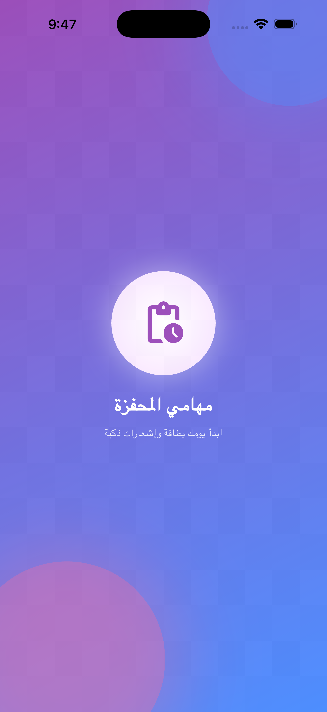
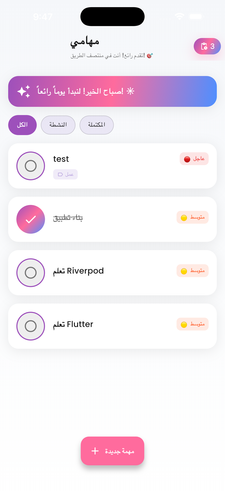
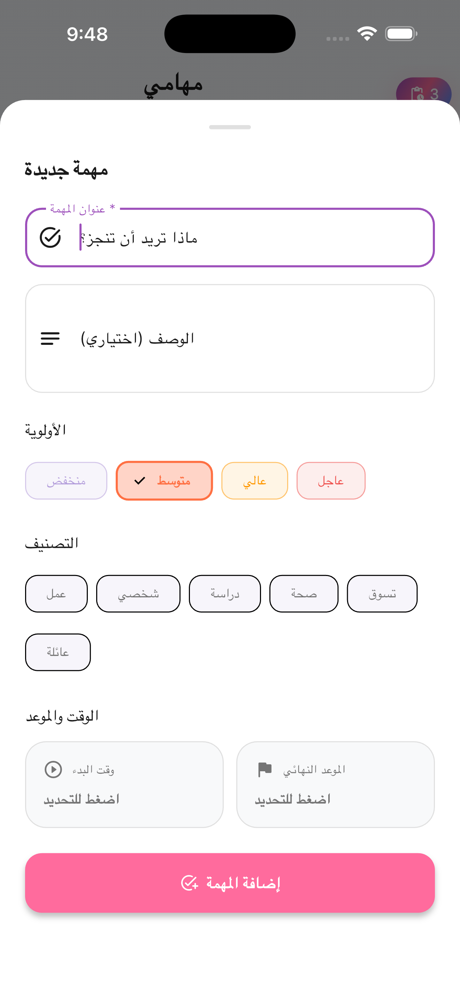
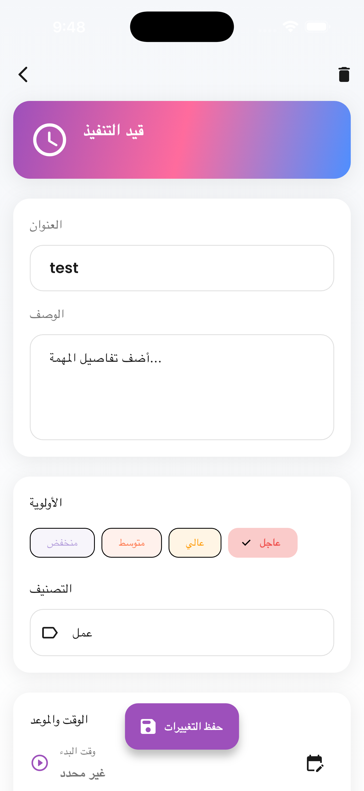
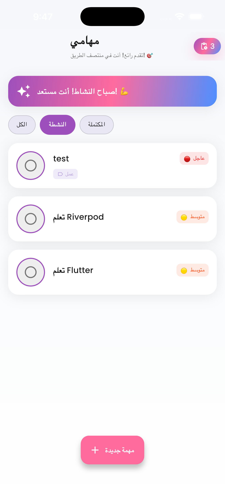
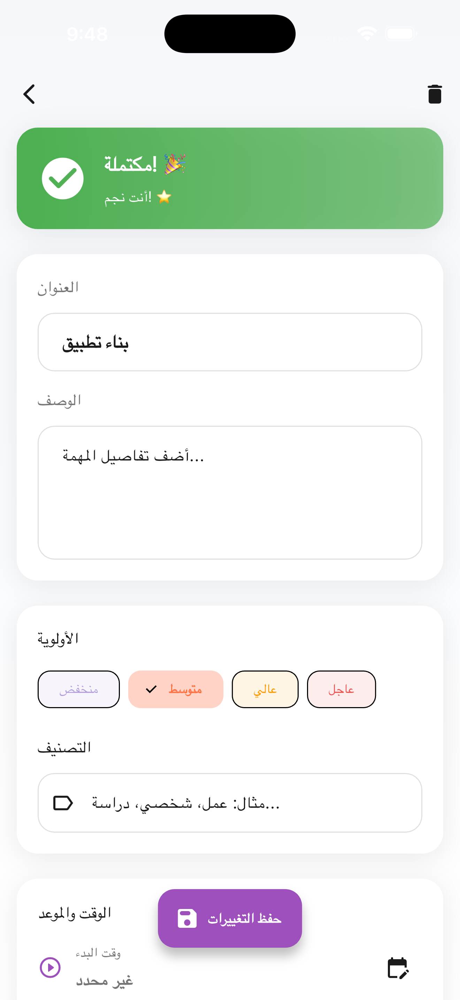
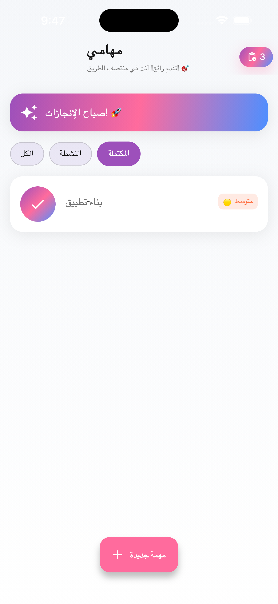

<div align="center">

# 📋 Smart To-Do App

### A Beautiful & Intelligent Task Management Application Built with Flutter

[](https://flutter.dev)
[](https://dart.dev)
[](https://riverpod.dev)
[](LICENSE)

[Features](#-features) • [Screenshots](#-screenshots) • [Demo](#-demo) • [Installation](#-installation) • [Technologies](#-technologies-used) • [License](#-license)

</div>

---

## 📖 About

**Smart To-Do App** is a feature-rich, visually stunning task management application designed to help users organize their daily tasks with style and efficiency. Built with Flutter and powered by Riverpod state management, this app combines beautiful animations, intelligent notifications, and seamless user experience to make task management delightful.

### ✨ Why This App?

- 🎨 **Modern Design**: Gradient themes, smooth animations, and polished UI
- ⏰ **Smart Reminders**: Multiple notification types with timezone support
- 📊 **Time Tracking**: Visual progress indicators and deadline management
- 🎯 **Priority System**: Organize tasks by priority and category
- 💾 **Offline First**: Local storage with Hive for instant access
- 🌍 **RTL Support**: Arabic locale with proper right-to-left layout
- 🎉 **Motivational UX**: Confetti celebrations and encouraging messages

---

## 🚀 Features

### Core Functionality
- ✅ **Task Management**: Create, edit, delete, and complete tasks
- 📁 **Categories**: Organize tasks by Work, Personal, Shopping, Health, and more
- 🎯 **Priority Levels**: High, Medium, Low priority indicators
- ⏱️ **Time Tracking**: Start time, deadline, and time-remaining calculations
- 📝 **Rich Details**: Task descriptions, notes, and metadata

### Smart Notifications
- 🔔 **Task Start Reminders**: Get notified when it's time to begin
- ⏰ **Pre-Deadline Alerts**: Customizable reminders (5, 10, 15, 30 minutes before)
- 📅 **Deadline Notifications**: Never miss a deadline again
- 🎊 **Completion Celebrations**: Feel accomplished with every completed task
- 🏆 **All Done Alert**: Special notification when all tasks are completed

### Advanced Features
- 🔍 **Smart Filters**: View Active, Completed, or All tasks
- 🎨 **Dynamic Themes**: Light and dark mode support
- 💫 **Smooth Animations**: Flutter Animate, Lottie, and staggered animations
- 📊 **Progress Visualization**: Circular percent indicators for time tracking
- 🎭 **Motivational System**: Contextual encouraging messages
- 📱 **Responsive Design**: Works beautifully on all screen sizes
- 🌐 **Splash Screen**: Animated gradient introduction

### User Experience
- 👆 **Swipe Actions**: Slidable list items for quick edit/delete
- 🎯 **Interactive Badges**: Tap pending tasks badge to filter active items
- 📲 **Bottom Sheet**: Modern task creation interface
- 🎨 **Category Colors**: Visual distinction for different task types
- ✨ **Shimmer Loading**: Elegant loading states
- 🎉 **Confetti Effects**: Celebrate task completions

---

## 📸 Screenshots

<div align="center">

### Main Screens

| Splash Screen | Task List | Add Task |
|:---:|:---:|:---:|
|  |  |  |

### Task Details & Filters

| Task Details | Active Filter | Completed Tasks |Completed_filter Tasks |
|:---:|:---:|:---:|
|  |  |  | |


</div>

---

## 🎥 Demo

<div align="center">

### App in Action


*Experience the smooth animations, intuitive gestures, and delightful interactions*

</div>

---

## 🛠️ Technologies Used

### Framework & Language
- **Flutter 3.10+**: Google's UI toolkit for beautiful, natively compiled applications
- **Dart 3.10+**: Client-optimized language for fast apps on any platform

### State Management & Architecture
- **Riverpod 3.x**: Modern, compile-safe state management
- **Provider Pattern**: Reactive state updates and dependency injection
- **Repository Pattern**: Clean separation of data and business logic

### Navigation & Routing
- **GoRouter**: Declarative routing with type-safe navigation
- **Deep Linking**: Support for URL-based navigation

### Local Storage & Persistence
- **Hive**: Lightning-fast key-value database
- **Hive Flutter**: Flutter integration for Hive
- **Type Adapters**: Custom serialization for complex objects

### Notifications & Permissions
- **Flutter Local Notifications**: Cross-platform notification support
- **Timezone**: Accurate scheduling across time zones
- **Permission Handler**: Runtime permission requests

### UI & Animations
- **Flutter Animate**: Powerful declarative animations
- **Lottie**: JSON-based animations for rich visuals
- **Flutter Staggered Animations**: Beautiful list animations
- **Confetti**: Celebration effects for task completion
- **Shimmer**: Loading state animations
- **Percent Indicator**: Circular progress visualizations

### UI Components
- **Flutter Slidable**: Swipe actions for list items
- **Google Fonts**: Custom typography (Poppins)
- **Flutter Datetime Picker Plus**: Enhanced date/time selection

### Development Tools
- **Build Runner**: Code generation for Hive adapters
- **Hive Generator**: Automatic adapter generation
- **Flutter Launcher Icons**: Custom app icon generation

### Networking (Ready for Backend)
- **Dio**: HTTP client prepared for API integration

---

## 📦 Installation

### Prerequisites

- **Flutter SDK**: 3.10.0 or higher
- **Dart SDK**: 3.10.0 or higher
- **Android Studio** / **Xcode** (for mobile development)
- **Git**: For cloning the repository

### Quick Start

1️⃣ **Clone the Repository**
```bash
git clone https://github.com/AbdallahRehab/flutter-todo-app.git
cd flutter-todo-app
```

2️⃣ **Install Dependencies**
```bash
flutter pub get
```

3️⃣ **Generate Hive Adapters** (if needed)
```bash
flutter pub run build_runner build --delete-conflicting-outputs
```

4️⃣ **Run the App**
```bash
flutter run
```

### Platform-Specific Setup

#### iOS
```bash
cd ios
pod install
cd ..
flutter run
```

#### Android
```bash
flutter run
```

#### Web
```bash
flutter run -d chrome
```

---

## 🏗️ Build for Release

### Android APK
```bash
flutter build apk --release
```
APK location: `build/app/outputs/flutter-apk/app-release.apk`

### Android App Bundle (for Play Store)
```bash
flutter build appbundle --release
```

### iOS
```bash
flutter build ios --release
```

### Web
```bash
flutter build web --release
```

---

## 📁 Project Structure

```
lib/
├── main.dart                      # App entry point
├── core/
│   ├── constants/                 # App constants
│   ├── router/
│   │   └── app_router.dart       # GoRouter configuration
│   ├── services/
│   │   ├── hive_service.dart     # Local storage service
│   │   ├── notification_service.dart  # Notification handling
│   │   └── motivational_service.dart  # Motivational messages
│   └── theme/
│       └── app_theme.dart        # Theme configuration
└── features/
    └── todos/
        ├── data/
        │   ├── datasources/      # Remote & local data sources
        │   ├── models/           # Data models
        │   └── repositories/     # Repository implementations
        ├── domain/
        │   ├── entities/         # Business entities
        │   └── repositories/     # Repository contracts
        └── presentation/
            ├── notifiers/        # State management
            ├── pages/            # UI screens
            ├── providers/        # Riverpod providers
            └── widgets/          # Reusable components
```

---

## 🎯 Future Enhancements

- [ ] 🌐 **Backend Integration**: Connect to REST API for cloud sync
- [ ] 👥 **User Authentication**: Firebase Auth or custom backend
- [ ] ☁️ **Cloud Sync**: Sync tasks across devices
- [ ] 🔄 **Recurring Tasks**: Support for repeating tasks
- [ ] 📊 **Analytics Dashboard**: Task completion statistics
- [ ] 🏷️ **Custom Tags**: User-defined task tags
- [ ] 🔍 **Search Functionality**: Search tasks by keyword
- [ ] 📤 **Export/Import**: Backup and restore tasks
- [ ] 🎨 **Custom Themes**: User-selectable color schemes
- [ ] 🗣️ **Voice Input**: Add tasks via voice commands
- [ ] 🌙 **Auto Dark Mode**: System-based theme switching
- [ ] 📱 **Widget Support**: Home screen widgets

---

## 🤝 Contributing

Contributions are welcome! Feel free to submit issues and pull requests.

1. Fork the repository
2. Create your feature branch (`git checkout -b feature/amazing-feature`)
3. Commit your changes (`git commit -m 'feat: add amazing feature'`)
4. Push to the branch (`git push origin feature/amazing-feature`)
5. Open a Pull Request

---

## 📄 License

This project is licensed under the MIT License - see the [LICENSE](LICENSE) file for details.

---

## 👨‍💻 Author

Abdallah Ali Rehab

- 📧 Email: abdorehab95@gmail.com
- 💼 LinkedIn: [linkedin.com/in/AbdallahAliRehab](https://www.linkedin.com/in/abdallah-ali-rehab-a71246153)
- 🐱 GitHub: [@AbdallahRehab](https://github.com/AbdallahRehab)
- 🌐 Portfolio: [abdallahrehab.github.io](https://abdallahrehab.github.io/)

---

## 🙏 Acknowledgments

- Flutter team for the amazing framework
- Riverpod community for excellent state management
- All open-source contributors whose packages made this possible

---

<div align="center">

### ⭐ Star this repo if you found it helpful!

**Made with ❤️ and Flutter**

</div>
